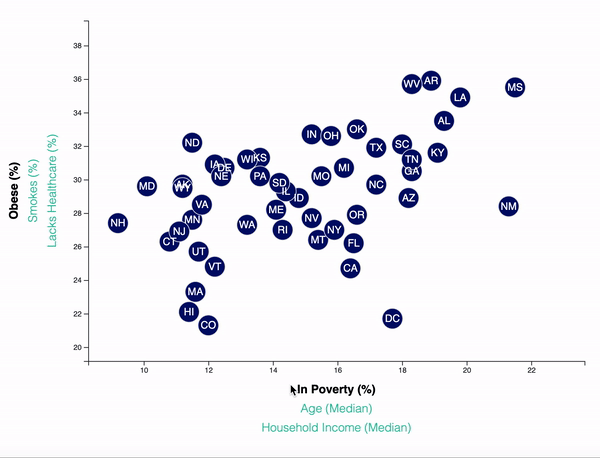

## Data Journalism: An Interactive Dashboard on the Current Trends and Health Factors that Shaping People's Lives in the United States of America
 
 

## Background

These repository investigate the relationship between income, obesity, poverty with demographic factors and health risks for 50 states and the District of Columbia in the United States of America. Median age, household income, and poverty rates are plotted against the smoking, lack of healthcare, and obesity rates for each state or district.
### Key Findings:
- States or districts with lower income or higher poverty rates show higher rates of health risks.
- The findings from the data show that there is a positive correlation between the states or districts poverty rate (%), and the rate of risk factors % (Obese, Smokers, and Lack of Health Care).
- There is a negative correlation between household income (Median), and the rate of risk factors % (Obese, smokes, and lack of health care).
- The age demographic is densely populated within the middle age range from age 30-45.

### An Interactive Scatter Plot on the Patterns

The chart showing the relationship between health factors (x-axis) obese, smokes, lack of health care with demographic factors (y-axis) age, household income, and poverty rate. To see the relationships, click on any of the font color green factors from the horizontal (x-axis) or vertical panel (y-axis), when the font color changed to black it means it’s active in the chart.The data points for each state represented by the blue-black background scatter plots in the active chart, the state code written on it with white font, and hover over it to see the detail information.

## Correlations Discovered Between Health Risks and Age, Income

### Poverty Rate or Household Income (Median) Versus Health Risks
The findings from the data show that there is a positive correlation between the state or district poverty rate (%), and the rate of risk factors % (Obese, Smokers, and Lack of Health Care). When the poverty rate is higher the tendency to get obese, and bing smoker is higher. Lack of health care is also directly related to the poverty rate. In the finding, there is also a negative correlation between household income (Median), and the rate of risk factors % (Obese, smokes, and lack of health care). When income getting higher the prevalence of the risk factors becomes lower.

Researches also showed that socioeconomic status can be determined by a family's income level, education level, and occupational status. (Cowan CD & et al. 2012) In spite of the differences in definition between poverty and socioeconomic status, researchers agree that there is a clear, and established relationship between poverty, socioeconomic status, and health outcomes, including increased risk for disease and premature death.(Wagstaff. A 2002)

### Age Versus Health Risks
It is vague to conclude the relationship between age, and health risks from the data. However, the age demographic is densely populated within the middle age range from age 30-45. Studies showed that middle-age is the wider age range of lifetime, and at this stage, people start experiencing different life-threatening health factors. People with a good lifestyle and socio-economic status will cope successfully at this stage.

## Over All layout
The dashboard looks as follows:

## Deployment
This app is deployed public on GitHub page, click the following link to see how it looks like

## About the Data
[https://factfinder.census.gov/faces/nav/jsf/pages/searchresults.xhtml](https://factfinder.census.gov/faces/nav/jsf/pages/searchresults.xhtml),

Trilogy Education Services © 2020. All Rights Reserved.
